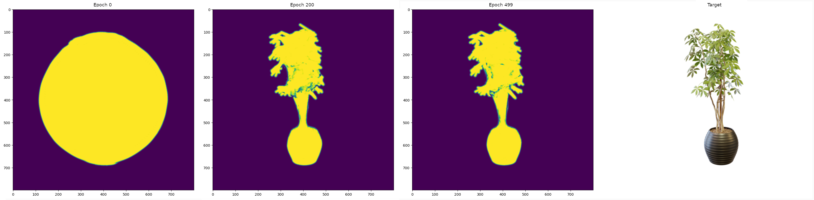
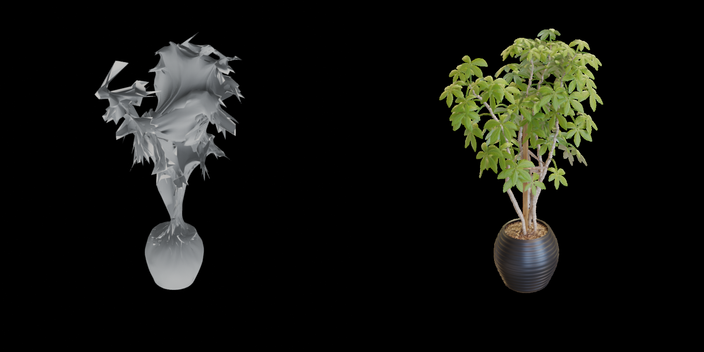
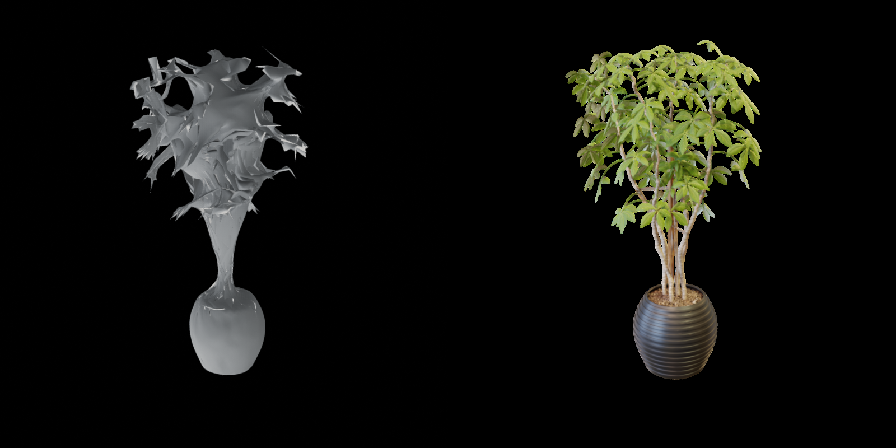
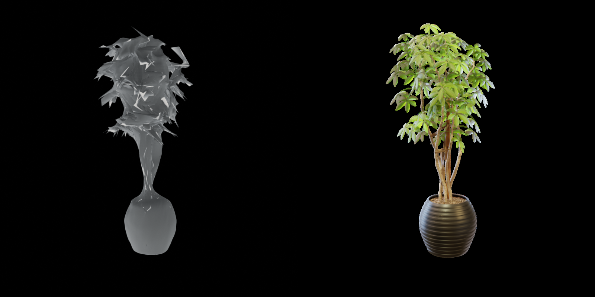
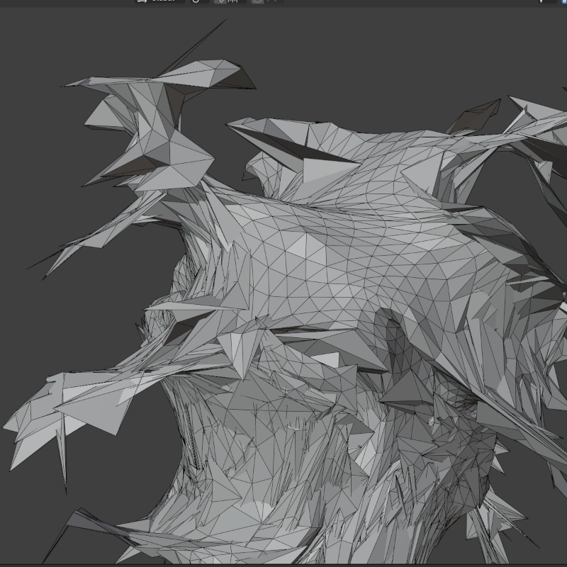
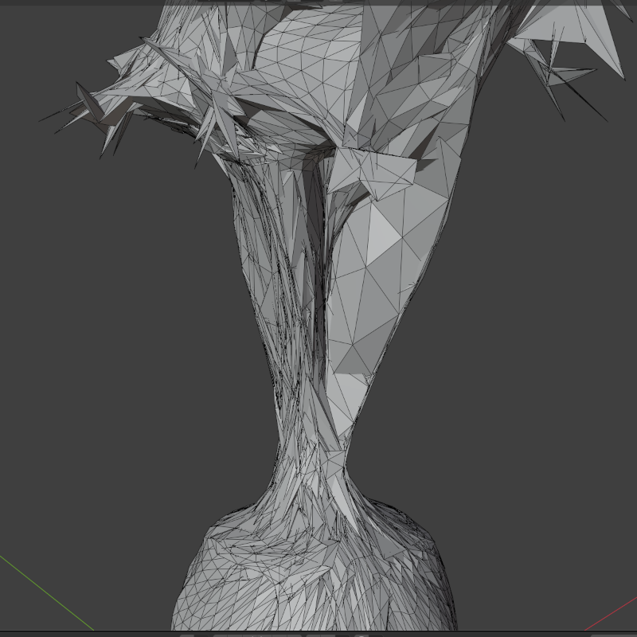
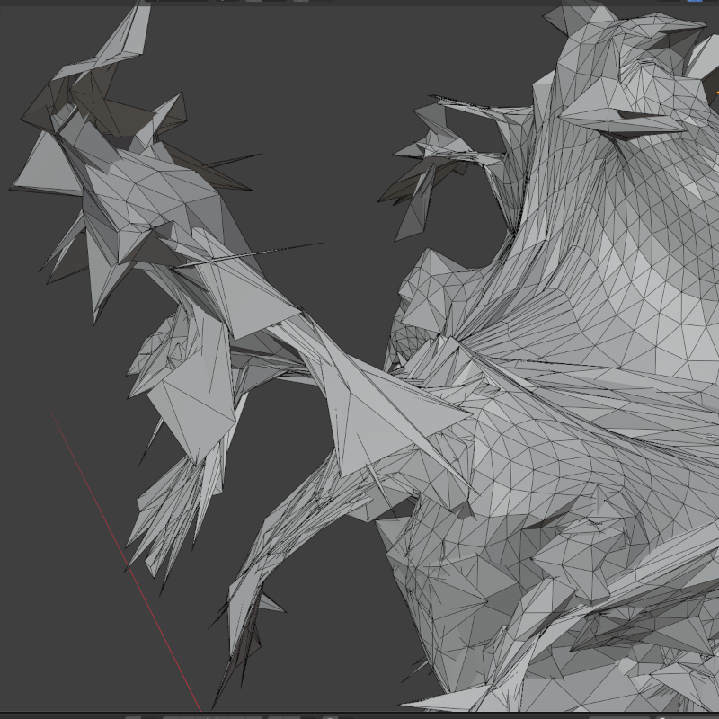

# Differentiable 3D Mesh Fitting: From Sphere to Accurate Mesh in 60 Minutes

Stack: PyTorch, PyTorch3D, Python · See the [full writeup](https://stephanbrezinsky.com/projects/diff-rendering/) for a
deep dive.

A pipeline that deforms a sphere primitive into a target 3D mesh using only 2D
reference images. It replaces a multi-day manual modeling task with ~60 minutes
of GPU compute on a GB10.

 [VISUAL:
Side-by-side — initial sphere | intermediate mesh (~200 iterations) | final mesh
(~500 iterations) | ground truth comparison]

## The Problem

Constructing an accurate 3D mesh from 2D reference images is a common task in 3D
vision. Doing it by hand is brutal. Pushing individual vertices in one view can
deform the mesh in ways that break other views. A skilled artist can spend days
on a single object. These questions drive this project:

- Using machine learning and differentiable rendering, can you collapse a mesh
  modeling timeline?
- Can mesh optimization produce an immediately usable result? Or a strong
  starting point for manual refinement?

## Pipeline

1. **Load** 2D images and corresponding camera poses (transformation matrices).
1. **Render** a differentiable silhouette of the current mesh from each camera
   pose.
1. **Compare** the silhouette to the ground-truth image mask via a custom loss
   function.
1. **Backpropagate** through the PyTorch3D renderer to update vertex positions.
1. **Output** a final .obj mesh.

The core loop follows PyTorch3D's
[mesh fitting tutorial](https://pytorch3d.org/tutorials/fit_textured_mesh). The
engineering work is in making it converge on real-world data with complex
geometry. Four design decisions made that possible.

## Key Design Decisions

### 1. General-Purpose Coordinate Conversion

**Problem**: Input data uses Blender/NeRF/COLMAP conventions. PyTorch3D expects
row-major, left-handed NDC space. An incorrect transform means fitting to the
wrong viewpoint, or never converging at all.

**Decision**: Instead of hardcoding a single Blender-to-PyTorch3D transform, I
built a general conversion pipeline. It covers the object → world → camera →
NDC/clip → screen space chain, across both row-major and column-major
conventions.

**Outcome**: The pipeline handled both synthetic NeRF/Blender datasets and my
own real-world COLMAP captures. I also built
[camviz](https://github.com/stephanbrez/camviz), a camera matrix visualizer for
debugging coordinate issues.

### 2. Soft IoU Loss

**Problem**: The standard MSE loss suffers from class imbalance in silhouette
rendering. The target object can be a small fraction of the image. This makes
MSE get dominated by the "correctly empty" background. After 700 iterations the
mesh volume was still 2x too large.

**Decision**: I replaced MSE with a differentiable Soft IoU loss. IoU ignores
true negatives and focuses on the geometric overlap between prediction and
target. PyTorch3D's soft renderer produces varying-opacity edges. I tweaked the
IoU loss to prevent these edges from dominating the gradient signal.

**Outcome**: Volumes converged to the correct size in 50 iterations — a 14x
improvement. The optimizer could then spend the remaining budget on shape
refinement rather than scale correction.

### 3. Dynamic Loss Annealing

**Problem**: Silhouette loss alone produces broken meshes and crashes
PyTorch3D's differential solver. Vertices explode into jagged self-intersecting
geometry. Three regularization terms (Laplacian smoothing, normal consistency,
edge length) prevent this. Unfortunately, fixed weights force a trade-off. Too
much silhouette emphasis crashes at 50–100 iterations. Too much regularization
and the mesh has no recognizable shape at 600 iterations.

**Decision**: I made regularization weights dynamic with configurable per-term
annealing schedules (static, linear, cosine, exponential decay). Linear decay
was stable but caused the mesh to stall. Cosine and exponential decay continued
driving progress into the fine detail phase.

**Outcome**: A two-phase coarse-to-fine optimization in a single continuous run.
Iterations 0–100: aggressive structural deformation. Iterations 100–1000:
increasing regularization emphasis locks in surface quality. This takes a
pipeline that fails on complex geometry and makes it converge to usable meshes.

### 4. Multi-View Batching

**Problem**: Single-view optimization causes the mesh to oscillate. Vertices fit
one camera, then get yanked in the opposite direction for the next. This
destabilizes training and prevents convergence.

**Decision**: Process multiple views per iteration via `mesh.extend()` to
preserve the computation graph. Gradients accumulate across views back to the
single set of learnable vertex parameters.

**Outcome**: A batch size of 4 over-smoothed the gradient signal (barely any
change after 400 iterations). A batch size of 3 produced large structural
changes within the first 100 iterations with no oscillation.

---

## Results

| Metric        | Value                    |
| ------------- | ------------------------ |
| Hardware      | NVIDIA GB10 GPU          |
| Total runtime | ~60 min (500 iterations) |
| Per-step time | ~0.21 sec                |
| Peak VRAM     | 3365 MiB                 |

### Sample Set Metrics

[VISUAL: Final mesh renders alongside ground-truth reference images from same angles | rendered with [recon-bench](https://github.com/stephanbrez/recon-bench)]

📊 Image Metrics

| Metric        | Mean    |
| ------------- | ------- |
| psnr          | 17.1591 |
| ssim_windowed | 0.8441  |
| lpips         | 0.1714  |

📊 Image Metrics (per item)

| Item | psnr    | ssim_windowed | lpips  |
| ---- | ------- | ------------- | ------ |
| [0]  | 16.3373 | 0.8287        | 0.1892 |
| [1]  | 16.9737 | 0.8509        | 0.1708 |
| [2]  | 18.1515 | 0.8694        | 0.1353 |
| [3]  | 17.1741 | 0.8275        | 0.1904 |

- **~60 minutes vs. days of manual work**. The output mesh preserves major geometric features. It's immediately identifiable from any viewing angle.
- **Usable topology**. Edge uniformity, face normals, and surface smoothness are good enough for downstream use or as a base for manual refinement.
- **Cross-dataset compatibility**. Worked on synthetic and real-world captures without modification.
- **Consumer-GPU accessible**. At 0.21 sec/step and 3365 MiB VRAM, longer runs on less powerful hardware are feasible.

[VISUAL: Close-up comparison — areas where the mesh captures fine detail well vs. areas where it approximates]e

---

## Areas for Improvement

The output is a good mesh, not a great one. It's immediately recognizable, but
not production-ready for complex organic shapes without manual refinement. The
system also has no generative capabilities. If it's not in the source images, it
won't get modeled.

The harder problem is parameter tuning. The combinatorial space of annealing
schedules × regularization weights × batch size is large. A low loss also
doesn't guarantee a good mesh. A "bad" mesh can look correct, but cause
downstream problems for texturing, deformation, or scaling. Different use cases
also call for different mesh qualities: smooth surfaces for rendering vs.
accurate topology for simulation vs. uniform faces for subdivision. These
objectives directly oppose each other.

The pipeline also operates at fixed mesh resolution. One solution is adaptive
subdivision. It would add detail only where needed without the cost of a
globally dense mesh.

I'm exploring multi-objective optimization of the regularization weights via
Pareto front configurations across the quality trade-offs.

## 3D Vision vs. Deep Learning

This project sits on the 3D vision side. It has explicit geometry, deterministic
optimization, and direct inspection at every step. Working with deep learning
(particularly generative diffusion models) is a fundamentally different process.
Probability density modeling relies on statistical inference in high-dimensional
spaces. These can't be directly visualized or inspected the way a mesh can. It's
an entirely different mode of thinking.

Having worked in both domains, I find it easier to judge which approach fits a
given problem:

- Known camera poses with good coverage → 3D reconstruction and direct
  optimization of explicit geometry.
- Sparse views, novel object categories, texture generation → learned priors
  make more sense.
- Hybrid pipelines → where 3D vision seems to be heading.

As these domains continue to merge, the ability to switch between both ways of
thinking becomes the differentiator
